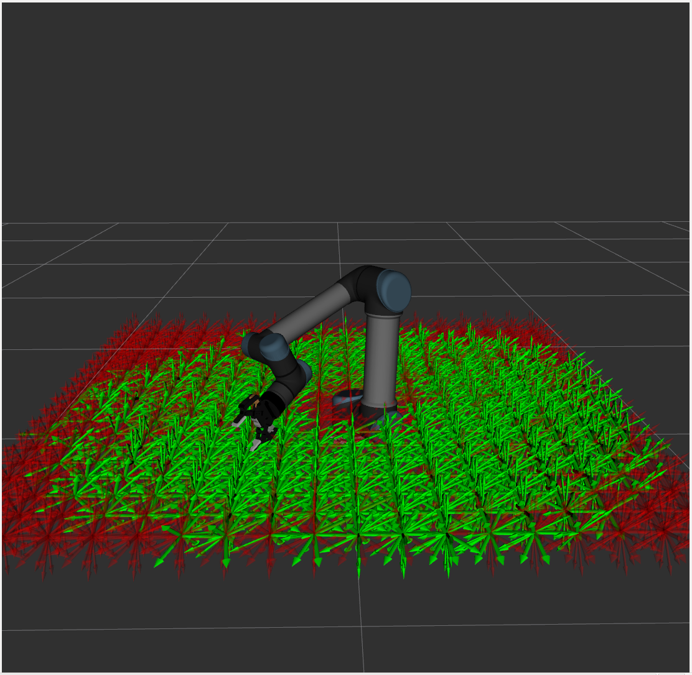

# ur5_robotiq_reachability_config

This ROS package contains the config files for using the reachability_energy_plugin for GraspIt!.

https://github.com/CRLab/reachability_energy_plugin

https://github.com/graspit-simulator/graspit

The workspace this config has been generated for is shown here:

